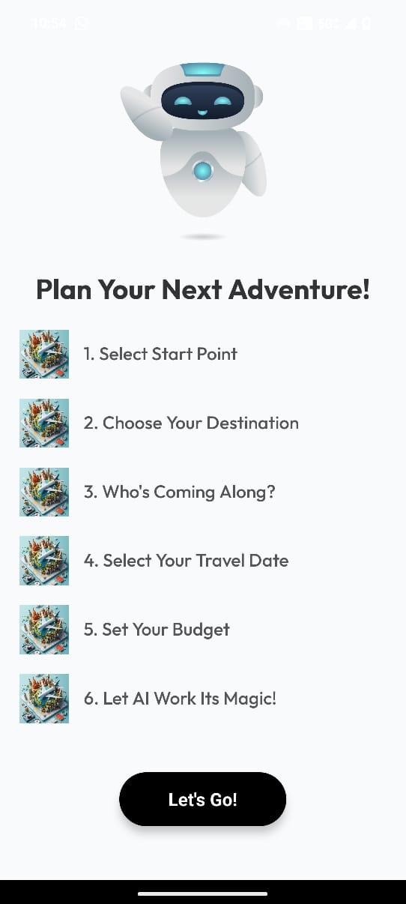
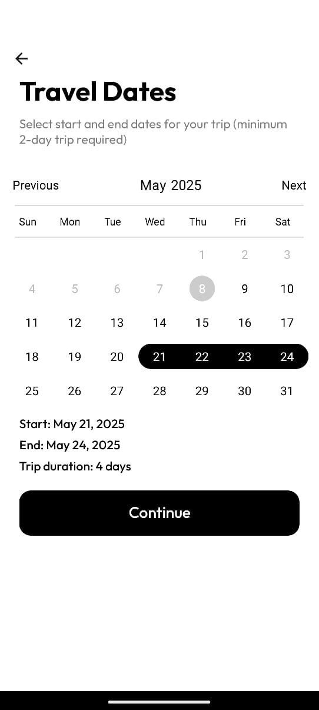

# 🧳 Let's Go! – AI Travel Planner App

<div align="center">
  
  

  **Your Personal AI-Powered Travel Buddy**  
  Plan smarter, travel better. Let AI handle the hard part so you can enjoy the journey. 🌍✈️
  
  [](https://github.com/yourusername/letsgo-ai-travel-planner/stargazers)
  [](https://github.com/yourusername/letsgo-ai-travel-planner/network/members)
  [](https://github.com/yourusername/letsgo-ai-travel-planner/issues)
  [](https://github.com/yourusername/letsgo-ai-travel-planner/blob/main/LICENSE)
  
</div>

---

## 📑 Table of Contents
- [🚀 Tech Stack](#-tech-stack)
- [✨ Features](#-features)
- [📱 App Screenshots](#-app-screenshots)
- [🎬 Demo](#-demo)
- [⚙️ Installation & Setup](#️-installation--setup)
- [🔌 API Configuration](#-api-configuration)
- [🧪 Running Tests](#-running-tests)
- [🛠️ Development Roadmap](#️-development-roadmap)
- [👥 Contributing](#-contributing)
- [📄 License](#-license)
- [👨‍💻 About Me](#-about-me)

---

## 🚀 Tech Stack

<div align="center">
  


</div>

---

## ✨ Features

### 🔐 User Authentication System  
Secure sign-in and sign-up using Firebase Authentication. Includes persistent login sessions and a sleek landing screen for first-time users.

### 🏠 Personalized Home Screen  
After logging in, users are welcomed with a personalized dashboard showing trip suggestions, quick actions, and recent activity.

### 🔎 Discover New Places  
Explore trending destinations and hidden gems with filters for categories like nature, food, culture, and more.

### 👤 User Profile Management  
Manage account details, view past trips, and customize preferences directly from the profile screen.

### ✨ AI-Powered Trip Planning  
Plan your perfect trip by entering destination, travel dates, number of travelers, and budget. Powered by Gemini AI for personalized itineraries.

### 🤖 Intelligent Itinerary Creation  
Gemini AI auto-generates smart daily schedules factoring in weather, popularity, travel times, and personal interests.

### 🧾 Smart Trip Management  
Track expenses, maintain a travel diary, and upload trip memories like videos and images — all in one place.

### 💬 Let's Go! AI Chat Assistant  
Need help while planning? Ask our AI assistant anything — from booking tips to local recommendations.

### 🏨 Accommodation and Flight Suggestions  
Get AI-curated hotel and flight options based on your dates, budget, and preferences — with links for direct booking.

### 🗺️ Offline Functionality  
Access saved trip data and itineraries without internet. View offline maps and sync when back online.

### 📱 Clean, Modern UI  
Built with React Native + Expo for a responsive and fast mobile-first experience. Dark mode supported.


---

## 📱 App Screenshots

<div align="center">
  <h3>✨ Experience the Let's Go! Journey ✨</h3>
</div>

### 🚪 Welcome to Let's Go!
<div align="center">
  <table>
    <tr>
      <td align="center">
        
        <br />
        <em>First Impression</em>
      </td>
      <td align="center">
        
        <br />
        <em>Welcome Screen</em>
      </td>
      <td align="center">
        
        <br />
        <em>Secure Login</em>
      </td>
    </tr>
  </table>
</div>

### 🏠 Home Experience
<div align="center">
  <table>
    <tr>
      <td align="center">
        
        <br />
        <em>Dashboard View</em>
      </td>
      <td align="center">
        
        <br />
        <em>Trip Overview</em>
      </td>
      <td align="center">
        
        <br />
        <em>Quick Actions</em>
      </td>
    </tr>
  </table>
</div>

### 🔍 Discover New Destinations
<div align="center">
  <table>
    <tr>
      <td align="center">
        
        <br />
        <em>Explore Destinations</em>
      </td>
      <td align="center">
        
        <br />
        <em>Location Details</em>
      </td>
      <td align="center">
        
        <br />
        <em>Your Travel Profile</em>
      </td>
    </tr>
  </table>
</div>

### ✈️ Plan Your Adventure
<div align="center">
  <p><i>The AI-powered trip creation process that makes planning effortless</i></p>
  
  <div class="grid-container" style="display: grid; grid-template-columns: repeat(2, 1fr); gap: 10px; margin: 0 auto; max-width: 800px;">
    <div>
      
      <br />
      <em>Select Destination</em>
    </div>
    <div>
      
      <br />
      <em>Choose Dates</em>
    </div>
    <div>
      
      <br />
      <em>Budget Planning</em>
    </div>
    <div>
      
      <br />
      <em>Travel Preferences</em>
    </div>
    <div>
      
      <br />
      <em>Accommodation Options</em>
    </div>
    <div>
      
      <br />
      <em>Activity Selection</em>
    </div>
    <div>
      
      <br />
      <em>AI Generation</em>
    </div>
    <div>
      
      <br />
      <em>Final Itinerary</em>
    </div>
  </div>
</div>

### 📔 Trip Management Tools
<div align="center">
  <p><i>Everything you need to organize and remember your journey</i></p>
  
  <table>
    <tr>
      <td align="center">
        
        <br />
        <em>Expense Tracker</em>
      </td>
      <td align="center">
        
        <br />
        <em>Travel Journal</em>
      </td>
      <td align="center">
        
        <br />
        <em>Photo Gallery</em>
      </td>
    </tr>
    <tr>
      <td align="center">
        
        <br />
        <em>Video Memories</em>
      </td>
      <td align="center">
        
        <br />
        <em>Trip Summary</em>
      </td>
    </tr>
  </table>
</div>

### 🤖 AI Travel Assistant
<div align="center">
  <p><i>Your 24/7 AI travel companion - powered by Gemini AI</i></p>
  
  <table>
    <tr>
      <td align="center">
        
        <br />
        <em>Ask Anything</em>
      </td>
      <td align="center">
        
        <br />
        <em>Smart Recommendations</em>
      </td>
    </tr>
  </table>
</div>

<div align="center">
  <h4>✨ Every screen thoughtfully designed for the perfect travel experience ✨</h4>
</div>

## 🎬 Demo

<div align="center">
  
  
  [Watch full demo on YouTube](https://www.youtube.com/watch?v=YOUTUBE_VIDEO_ID)
  **Coming soon...** 🚀  
  A full walkthrough video of the app in action will be uploaded here shortly.
  
</div>


---

## ⚙️ Installation & Setup

Make sure you have [Node.js](https://nodejs.org/) (v16+) and [Expo CLI](https://docs.expo.dev/get-started/installation/) installed.

```bash
# 1. Clone the repository
git clone https://github.com/yourusername/letsgo-ai-travel-planner.git

# 2. Navigate to the project directory
cd letsgo-ai-travel-planner

# 3. Install dependencies
npm install
# or
yarn install

# 4. Create a .env file with your API keys
cp .env.example .env
# Edit the .env file with your API keys

# 5. Start the development server
npx expo start
```

### 📱 Running on Your Device

- Install the Expo Go app on your [iOS](https://apps.apple.com/app/expo-go/id982107779) or [Android](https://play.google.com/store/apps/details?id=host.exp.exponent) device
- Scan the QR code from the terminal with your camera (iOS) or the Expo Go app (Android)
- Or run on simulators/emulators:
  ```bash
  # iOS Simulator
  npx expo run:ios
  
  # Android Emulator
  npx expo run:android
  ```

---

## 🔌 API Configuration

This app requires several API keys to work properly:

1. **Firebase Configuration**
   - Create a project in [Firebase Console](https://console.firebase.google.com/)
   - Add your Firebase config details to `.env` file:
     ```
     FIREBASE_API_KEY=your_api_key
     FIREBASE_AUTH_DOMAIN=your_auth_domain
     FIREBASE_PROJECT_ID=your_project_id
     FIREBASE_STORAGE_BUCKET=your_storage_bucket
     FIREBASE_MESSAGING_SENDER_ID=your_messaging_sender_id
     FIREBASE_APP_ID=your_app_id
     ```

2. **Gemini AI API**
   - Get your API key from [Google AI Studio](https://makersuite.google.com/)
   - Add to `.env` file:
     ```
     GEMINI_API_KEY=your_gemini_api_key
     ```

> ⚠️ **Never commit your .env file to version control!** Make sure it's listed in your .gitignore file.

---

## 🧪 Running Tests

```bash
# Run all tests
npm test

# Run specific test file
npm test -- -t "AuthScreen"

# Watch mode
npm run test:watch

# Generate test coverage report
npm run test:coverage
```

---

## 🛠️ Development Roadmap

- [ ] **v1.1.0** - Public transportation integration
- [ ] **v1.2.0** - Social sharing features
- [ ] **v1.3.0** - Budget tracking functionality
- [ ] **v1.4.0** - Multi-language support
- [ ] **v2.0.0** - Augmented reality points of interest

---

## 👥 Contributing

Contributions are what make the open-source community such an amazing place to learn, inspire, and create. Any contributions you make are **greatly appreciated**.

1. Fork the Project
2. Create your Feature Branch (`git checkout -b feature/AmazingFeature`)
3. Commit your Changes (`git commit -m 'Add some AmazingFeature'`)
4. Push to the Branch (`git push origin feature/AmazingFeature`)
5. Open a Pull Request

For major changes, please open an issue first to discuss what you would like to change.

---

## 📄 License

Distributed under the MIT License. See `LICENSE` for more information.

<div align="center">
  <p>If you found this project helpful, please consider giving it a ⭐!</p>
  
</div>
